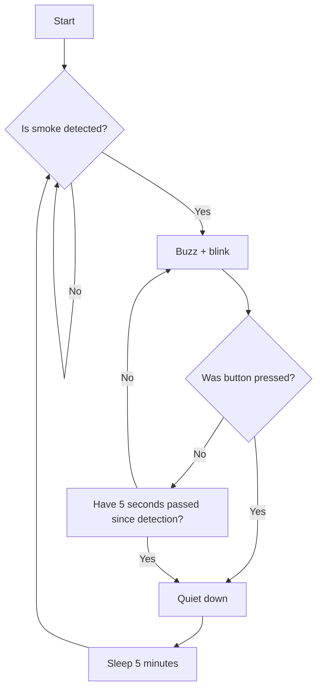

# Smoke detector

Simple smoke detector that will beep in a pattern until a button is pressed (which will snooze it for 5 minutes).

The main usage idea is to detect cigarette smoke and alert the user to close the window manually when it happens.

It uses `Arduino Uno R3` as the logic board.

# Circuit

Electronics schematic can be viewed using `Autodesk Eagle` (open the `schematic.sch` file).

The rendered png file is available as `schematic.png` and visible below.

# Logic

# End notes

This project makes use of:

- [RPI-Pico-Eagle-lib](https://github.com/Lobo-T/RPI-Pico-Eagle-lib) project for Eagle schematics of RPI Pico
- [Adafruit-Eagle-Library](https://github.com/adafruit/Adafruit-Eagle-Library) for Arduino Uno R3
- [Eagle-Libraries](https://github.com/chiengineer/Eagle-Libraries) project for the buzzer schematic
- [Eagle-Libraries](https://github.com/chiengineer/Eagle-Libraries) project for the tactile switch schematic
